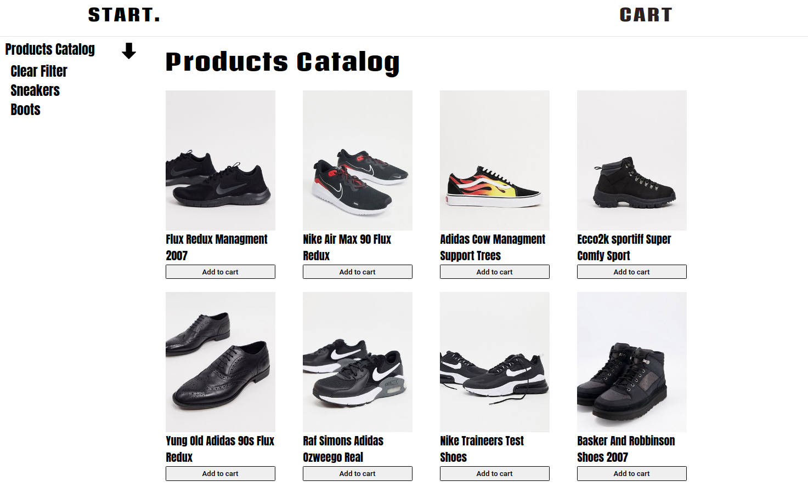
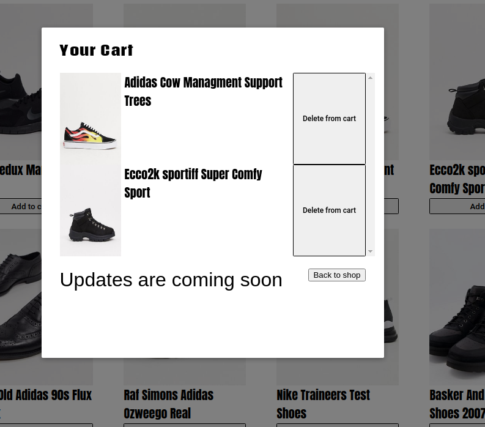

# Simple shop using Vue, VueX store and Vue-router

## Appearence 





[Link on working site for example](https://tripleheaven.github.io/cool-wearing-shop-vue/ "tip")

### Programm functions
   - Add to cart 
   - Open cart in a modal window
   - Delete from cart
   - Filter by: all, boots, sneakers

### Programm functions
Main functions
   - Добавление контакта
   - Удаление контакта (с подтверждением)
   - Переход на контактную информацию контакта
## Project setup
```
npm install
```

### Compiles and hot-reloads for development
```
npm run serve
```

### Compiles and minifies for production
```
npm run build
```

### Lints and fixes files
```
npm run lint
```

### Customize configuration
See [Configuration Reference](https://cli.vuejs.org/config/).
